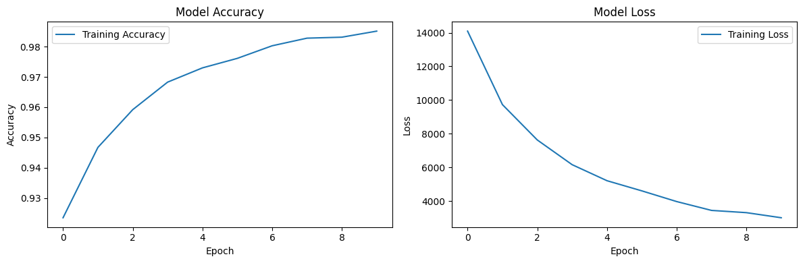

## MNIST Classification Example

Let's walk through a complete example using MicroKeras to classify handwritten digits from the MNIST dataset. This example will demonstrate how to load data, create a model, train it, make predictions, and save/load the model.

### Importing Dependencies

First, let's import the necessary modules:

```python
import numpy as np
from microkeras.models import Sequential
from microkeras.layers import Dense
from microkeras.optimizers import SGD
from microkeras.datasets import mnist
```

### Loading and Preprocessing Data

Next, we'll load the MNIST dataset and preprocess it:

```python
# Load and preprocess MNIST data
(X_train, y_train), (X_test, y_test) = mnist.load_data()

# Reshape and normalize the input data
X_train = X_train.reshape(X_train.shape[0], -1)
X_test = X_test.reshape(X_test.shape[0], -1)

# One-hot encode the labels
y_train = np.eye(10)[y_train]
y_test = np.eye(10)[y_test]

print("Data shapes:")
print(f"X_train: {X_train.shape}, y_train: {y_train.shape}")
print(f"X_test: {X_test.shape}, y_test: {y_test.shape}")
```

Output:

```
Data shapes:
X_train: (56000, 784), y_train: (56000, 10)
X_test: (14000, 784), y_test: (14000, 10)
```

### Creating the Model

Now, let's create our Sequential model:

```python
model = Sequential([
    Dense(200, activation='sigmoid', input_shape=(784,)),
    Dense(200, activation='sigmoid'),
    Dense(10, activation='softmax')
])
```

This model consists of two hidden layers with sigmoid activation and an output layer with softmax activation, suitable for multi-class classification.

### Compiling the Model

We'll compile the model using Stochastic Gradient Descent (SGD) as the optimizer and Categorical Cross-Entropy as the loss function:

```python
optimizer = SGD(learning_rate=0.1)
model.compile(optimizer=optimizer,
              loss='categorical_crossentropy',
              metrics=['accuracy'])
```

### Training the Model

Let's train the model for 10 epochs with a batch size of 32:

```python
history = model.fit(X_train,
                    y_train,
                    batch_size=16,
                    epochs=10)
```

Output:

```
Epoch 1/10
Batch 3500/3500 - Loss: 4.9410, Acc: 0.9238: : 3712it [00:37, 99.54it/s] 
Epoch 2/10
Batch 3500/3500 - Loss: 1.9095, Acc: 0.9746: : 3712it [00:20, 180.73it/s]
Epoch 3/10
Batch 3500/3500 - Loss: 1.5755, Acc: 0.9844: : 3712it [00:21, 168.76it/s]
Epoch 4/10
Batch 3500/3500 - Loss: 1.2145, Acc: 0.9844: : 3712it [00:22, 162.42it/s]
Epoch 5/10
Batch 3500/3500 - Loss: 0.9108, Acc: 0.9902: : 3712it [00:23, 157.83it/s]
Epoch 6/10
Batch 3500/3500 - Loss: 0.7050, Acc: 0.9941: : 3712it [00:21, 175.94it/s]
Epoch 7/10
Batch 3500/3500 - Loss: 0.4757, Acc: 0.9980: : 3712it [00:20, 183.64it/s]
Epoch 8/10
Batch 3500/3500 - Loss: 0.4843, Acc: 1.0000: : 3712it [00:22, 164.84it/s]
Epoch 9/10
Batch 3500/3500 - Loss: 0.4095, Acc: 0.9980: : 3712it [00:22, 164.12it/s]
Epoch 10/10
Batch 3500/3500 - Loss: 0.3842, Acc: 0.9961: : 3712it [00:21, 176.15it/s]
```

### Plotting Training History

We can plot the training history using Matplotlib:

```python
# Plot training history
import matplotlib.pyplot as plt

plt.figure(figsize=(12, 4))
plt.subplot(1, 2, 1)
plt.plot(history['accuracy'], label='Training Accuracy')
plt.title('Model Accuracy')
plt.ylabel('Accuracy')
plt.xlabel('Epoch')
plt.legend()

plt.subplot(1, 2, 2)
plt.plot(history['loss'], label='Training Loss')
plt.title('Model Loss')
plt.ylabel('Loss')
plt.xlabel('Epoch')
plt.legend()

plt.tight_layout()
plt.show()
```

Output:



### Evaluating the Model

After training, we can evaluate the model on the test set:

```python
test_loss, test_accuracy = model.evaluate(X_test, y_test)
print(f"Test accuracy: {test_accuracy:.4f}")
```

Output:

```
Test accuracy: 0.9671
```

### Making Predictions

Let's make predictions for the first 5 test samples:

```python
predictions = model.predict(X_test[:5])
print("Predictions for the first 5 test samples:")
print(np.argmax(predictions, axis=1))
print("Actual labels:")
print(np.argmax(y_test[:5], axis=1))

# Visualize the predictions
plt.figure(figsize=(12, 4))
for i in range(5):
    plt.subplot(1, 5, i+1)
    plt.imshow(X_test[i].reshape(28, 28), cmap='gray')
    plt.title(f"Pred: {np.argmax(predictions[i])}\nTrue: {np.argmax(y_test[i])}")
    plt.axis('off')
plt.tight_layout()
plt.show()
```

Output:

```
Predictions for the first 5 test samples:
[8 4 8 7 7]
Actual labels:
[8 4 8 7 7]
```


### Saving and Loading the Model

MicroKeras allows you to save and load models:

```python
# Save the model
model.save('mnist_model.json')

# Load the model
loaded_model = Sequential.load('mnist_model.json')

# Compile the loaded model
loaded_model.compile(optimizer=optimizer,
                     loss='categorical_crossentropy',
                     metrics=['accuracy'])

# Evaluate the loaded model
loaded_test_loss, loaded_test_accuracy = loaded_model.evaluate(X_test, y_test)
print(f"Loaded model test accuracy: {loaded_test_accuracy:.4f}")
```

Output:

```
Loaded model test accuracy: 0.9671
```

### Viewing Training History

Finally, let's print out the training history:

```python
print("\nTraining History:")
print("Epoch\tAccuracy\tLoss")
for epoch, (accuracy, loss) in enumerate(zip(history['accuracy'], history['loss']), 1):
    print(f"{epoch}\t{accuracy:.4f}\t{loss:.4f}")
```

Output:

```
Training History:
Epoch	Accuracy	Loss
1	0.9235	14096.9166
2	0.9467	9728.8764
3	0.9592	7629.1049
4	0.9683	6160.9156
5	0.9730	5208.7316
6	0.9761	4604.9854
7	0.9803	3969.1862
8	0.9828	3443.3674
9	0.9831	3310.2258
10	0.9851	3007.7300
```
